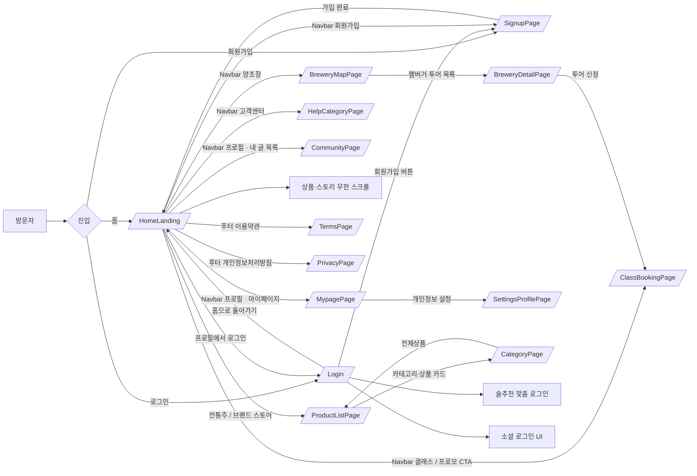
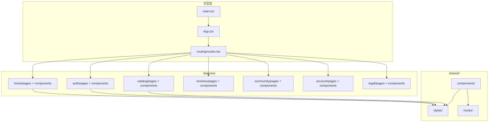
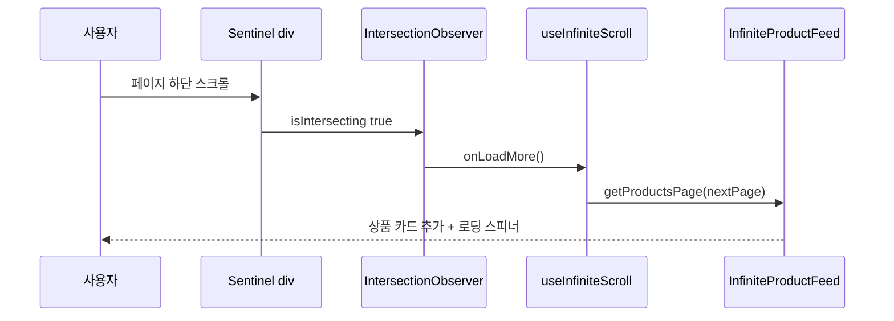

<div align="center">

# 🍶 빚담

**Bitdam** — 전국 양조장의 장인 정신을 담은 프리미엄 전통주 플랫폼

> 시간이 흐를수록 깊어지는 우리 고유의 맛과 향 · 홈 랜딩 · 상품 목록 · 카테고리 상세 · 로그인 · 반응형

<br/>

[](https://react.dev/)
[](https://www.typescriptlang.org/)
[](https://vite.dev/)
[](https://tailwindcss.com/)
[](https://reactrouter.com/)

<br/>

**📦 저장소:** [github.com/zyansuh/bitdam](https://github.com/zyansuh/bitdam)

</div>

---

## 목차

1. [프로젝트 소개](#-이-프로젝트는)
2. [페이지 · 이용 흐름](#-페이지--이용-흐름)
3. [주요 기능](#-주요-기능)
4. [사용 기술](#-사용-기술-tech-stack)
5. [아키텍처 · 소스 구조](#️-아키텍처--소스-구조)
6. [디자인 토큰 · 반응형](#-디자인-토큰--반응형)
7. [무한 스크롤](#-무한-스크롤)
8. [빠른 시작](#-빠른-시작)
9. [npm 스크립트](#-npm-스크립트)
10. [개발 규칙](#-개발-규칙)
11. [커밋 · PR · Cursor](#-커밋--pr--cursor)
12. [트러블슈팅](#-트러블슈팅)
13. [로드맵 · Changelog](#-로드맵--changelog)

---

## 📖 이 프로젝트는?

**빚담(Bitdam)** 은 전통주 브랜드 웹사이트를 위한 **React SPA 프론트엔드**입니다.  
디자인 시안(`pc-home-landing`, `pc-search-filter`, `pc-category-list`, `pc-onboarding-login`)을 기준으로 홈 랜딩·상품 목록·카테고리 상세·로그인 화면을 구현했으며, 모바일·태블릿·데스크톱 전 구간에서 동일한 UX를 제공합니다.

| 구분 | 설명 |
|------|------|
| **프론트** | React 19 · Vite 6 · TypeScript · Tailwind CSS v4 |
| **라우팅** | react-router-dom — `/` · `/story` · `/ir` · `/products` · `/category/:slug` · `/breweries` · `/breweries/:id` · `/classes` · `/community` · `/mypage` · `/account` · `/login` · `/signup` · `/terms` · `/privacy` |
| **상태** | 현재 mock 데이터 · API/OAuth 미연동 |
| **배포** | (예정) Vercel / Netlify 등 정적 호스팅 |

### 브랜드 핵심 메시지

| 항목 | 내용 |
|------|------|
| **슬로건** | 다섯 개의 손이 한 병에 모이다 |
| **규모** | 전국 31개 제휴 양조장 · 9개 권역 · 5개 국가유산 장인 손맛 |
| **톤** | cream / gold / navy — 전통과 현대의 조화 |

---

## 🗺️ 페이지 · 이용 흐름

### 라우트

| 경로 | 페이지 | 설명 |
|------|--------|------|
| `/` | `HomeLanding` | 브랜드 소개 · 통계 · 급상승 술 · 양조장 배너 · 스토리 피드 |
| `/story` | `BrandStoryPage` | 시간이 흐를수록 · 못난이 과일 · 철학·펀딩·여정 |
| `/custom` | `CustomLabelPage` | 기념주 라벨 4단계 맞춤 · 실시간 견적 |
| `/gift` | `GiftPage` | 선물 3단계: 상품 선택 → 메시지 → 결제 |
| `/events` · `/events/:slug` | `HolidayEventPage` | 명절 특별전 · TIME REMAINING · 응모 인원 |
| `/deals` | `TimeSalePage` | 상시 타임 특가 · 카운트다운 · 할인 필터 |
| `/subscribe` | `SubscribePage` | 상시 정기 구독 플랜 · 가이드 · FAQ |
| `/corporate` | `CorporateGiftPage` | 상시 단체·기업 선물 · 수량 할인 · 견적 |
| `/holiday/gifts` | `HolidayGiftSalePage` | 명절 선물세트 할인전 · 필터 · 카운트다운 |
| `/events/daily` | `DailyEventPage` | 일상 복주머니 · 7일 쿠폰 · 공유 스탬프 |
| `/holiday/tours` | `HolidayTourPage` | 명절 전용 양조장 투어 |
| `/limited` | `LimitedEditionPage` | 크리에이터 한정판 · 테이스팅 · 펀딩 선예약 |
| `/ir` | `IrPage` | 투자 IR · 카탈로그 기반 KPI · 프리 A · 문의 |
| `/products` | `ProductListPage` | 검색 · 카테고리 칩 · 상세 필터 · 상품 그리드 |
| `/category/:slug` | `CategoryPage` | 남색 헤더 · 브레드크럼 · 대표 상품 캐러셀 · 도수 필터 |
| `/login` | `Login` | 이메일 로그인 · 카카오 로그인 · 소셜 버튼 |
| `/signup` | `SignupPage` | 닉네임·이메일·비밀번호 일반 회원가입 |
| `/login/kakao/callback` | `KakaoCallbackPage` | 카카오 OAuth 콜백 |
| `/breweries` | `BreweryMapPage` | 권역 탭 · MapLibre 지도 · 추천 양조장 |
| `/tours` | `TourReservePage` | 권역별 양조장 정보 · 예약 창 |
| `/breweries/:id` | `BreweryDetailPage` | 양조장 이야기 · 포함 사항 · 날짜·타임·인원 예약 카드 |
| `/classes` | `ClassBookingPage` | 체험 클래스 필터 · 예약(로컬 상태) |
| `/community` | `CommunityPage` | 본인 글 목록 · 분류 · 해시태그 |
| `/community/new` | `CommunityWritePage` | 글쓰기 · 임시저장 · 사진 첨부 |
| `/community/:id` | `CommunityPostPage` | 글 상세 · 좋아요 · 댓글 |
| `/terms` | `TermsPage` | 서비스 운영정책 · 이용약관 · 개인정보 · 사업자 정보 |
| `/privacy` | `PrivacyPage` | 개인정보처리방침 제1조~제16조 |
| `/mypage` | `MypagePage` | 주문 요약 · 최근 주문 · NFT 보증서 |
| `/mypage/certificates` | `MypageCertificatesPage` | 전통주 인증서(NFT) |
| `/mypage/coupons` | `MypageCouponsPage` | 쿠폰 및 혜택 |
| `/mypage/addresses` | `MypageAddressesPage` | 배송지 관리 |
| `/mypage/payments` | `MypagePaymentsPage` | 결제수단 관리 |
| `/mypage/support` | `MypageSupportPage` | 1:1 고객센터 |
| `/account` | `SettingsProfilePage` | 프로필 설정 |
| `/account/security` | `SettingsSecurityPage` | 보안 & 비밀번호 |
| `/account/notifications` | `SettingsNotificationsPage` | 알림 설정 |
| `/account/connections` | `SettingsConnectionsPage` | 연동된 서비스 |
| `/account/withdraw` | `SettingsWithdrawPage` | 탈퇴하기 |
| `/notifications` | `NotificationsPage` | 알림 센터 · 분류 필터 · 읽음 처리 |
| `/help` | `HelpHomePage` | 고객센터 → 배송 FAQ로 이동 |
| `/help/:category` | `HelpCategoryPage` | 주문/결제·배송·교환/반품·회원·포인트·기타 FAQ |
| `/help/chat` | `HelpChatPage` | `/chat`으로 이동 |
| `/notices` | `NoticeListPage` | 공지 목록 · 분류 탭 · 1~5페이지 |
| `/notices/new` | `NoticeWritePage` | 공지 작성 · 중요 토글 |
| `/notices/digest` | `NoticeDigestPage` | 중요·최근 모아보기 |
| `/notices/:id` | `NoticeDetailPage` | 공지 상세 |
| `/chat` | `ChatPage` | 빚담 추천 AI · 왼쪽 대화 목록 |

### 이용자 흐름



### 화면별 레이아웃

| 화면 | mobile (<600px) | tablet (600~999px) | desktop (≥1000px) |
|------|-----------------|--------------------|--------------------|
| **홈** | 헤더 · 햄버거(페이지·카테고리·투어·계정) · 상품 2열 | 상품 3열 · Stats 4열 | Nav 링크 + 햄버거 · Hero 2단 · 상품 4열 |
| **목록** | 필터 토글 · 상품 2열 | 필터 토글 · 상품 2열 | 좌측 sticky 필터 + 상품 3열 |
| **카테고리** | 남색 헤더 · 필터 토글 · 대표 상품 | 동일 + 넓은 캐러셀 | 남색 헤더 · 좌측 필터 + 캐러셀 |
| **로그인** | 상단 히어로 배너 + 폼 | 폼 중앙 · 피드 3열 | 좌측 sticky 히어로 + 우측 스크롤 |
| **회원가입** | 로그인과 동일 레이아웃 | 동일 | 동일 |
| **양조장** | 투어 헤더 · 햄버거 목록 · 지도 상단 | 지도·리스트 세로 | 양조장 투어 헤더 + 지도 2단 |
| **커뮤니티** | 글 목록 · 작성 폼 세로 | 동일 | 좌측 목록 + 본문 |
| **클래스** | 필터 토글 · 세션 카드 | 동일 | 좌측 필터 + 세션 목록 |
| **운영정책** | 남색 헤더 · 목차 칩 · 조문 스크롤 | 동일 | 동일 max-w-3xl |
| **개인정보처리방침** | 운영정책과 동일 레이아웃 | 동일 | 동일 |

---

## ✨ 주요 기능

### 🏠 홈 랜딩 (`/`)

| 섹션 | 컴포넌트 | 설명 |
|------|----------|------|
| 네비게이션 | `Navbar` | sticky 헤더 · 햄버거(전통주·양조장·이야기·계정 계층) · 검색·장바구니·프로필 |
| 히어로 | `Hero` | 「다섯 개의 손이 한 병에 모이다」· CTA 2종 |
| 통계 | `Stats` | 31곳 · 9개 권역 · 5개 · 100+ 명 |
| 급상승 술 | `InfiniteProductFeed` | 8개씩 paginate · Intersection Observer 무한 스크롤 |
| 프로모션 | `PromoBanner` | 성수동 삼해소주 가옥 · CTA → `/classes?brewery=samhae` |
| 스토리 | `InfiniteStoryFeed` | 빚담 이야기 카드 · 4개씩 추가 로드 |
| 푸터 | `Footer` | **남색(`navy`)** 배경 · 서비스·고객지원·법적 고지 · Instagram/Facebook |

### 🗺️ 양조장 (`/breweries`)

카탈로그 헤더·홈 네비·푸터 「양조장 투어」는 `/breweries`로 연결됩니다. 지도는 MapLibre GL을 lazy chunk로 불러옵니다.

| 기능 | 설명 |
|------|------|
| **권역 탭** | 경기~제주 · 지도 포커스와 추천 리스트 동기화 |
| **핀** | 양조장 위치 · 팝업에서 상세(`/breweries/:id`) |
| **추천 카드** | 양조장 이야기 · 상품 목록(`/products`) |
| **클래스** | 상세 하단 투어 바 → `/classes?brewery=` |
| **투어 헤더** | 「양조장 투어」 강조 · 오른쪽 햄버거로 전체 사이트 메뉴·투어 목록 |

### ✍️ 커뮤니티 (`/community`)

프로필(사람) 아이콘을 누르면 「커뮤니티 · 내 글 목록」이 열립니다. 로그인한 계정으로 쓴 글만 보이고, 브라우저 `localStorage`에 저장됩니다.

| 기능 | 설명 |
|------|------|
| **글 목록** | 좌측(모바일은 상단) 제목 목록 · 본문 앵커로 이동 |
| **작성** | 제목 · 본문 · 게시하기 |
| **비로그인** | 로그인 안내 |

### 🍶 상품 목록 (`/products`)

시안 `pc-search-filter` 기준. 크림 헤더 · 검색바 · 카테고리 칩 · 좌측 상세 필터 · 3열 상품 그리드.

| 기능 | 설명 |
|------|------|
| **검색** | 상품명 · 지역 · 카테고리 텍스트 필터 |
| **카테고리 칩** | 탁주/막걸리 · 청주/약주 · 증류식소주 · 과실주 · 리큐르/기타 |
| **상세 필터** | 지역 체크박스 · 가격 슬라이더 · 맛 프로필 태그 |
| **정렬** | 인기순 · 낮은/높은 가격순 · 평점순 |
| **상품 카드** | 지역 · 도수 · 가격(골드) · 평점 · 클릭 시 카테고리 상세 |

### 📂 카테고리 상세 (`/category/:slug`)

시안 `pc-category-list` 기준. 남색 헤더 · 브레드크럼 · 대표 상품 캐러셀 · 도수 필터.

| slug | 화면 제목 |
|------|-----------|
| `takju` | 막걸리 / 탁주 |
| `yakju` | 청주 / 약주 |
| `soju` | 증류주 |
| `fruit` | 과실주 |
| `liqueur` | 리큐르 / 기타 |

### 🔐 로그인 (`/login`)

| 기능 | 설명 |
|------|------|
| **히어로 패널** | 데스크톱 좌측 50% sticky · 모바일 상단 배너 |
| **소셜 로그인** | 카카오 공식 버튼 이미지 · OAuth 코드 플로우 (`/login/kakao/callback`) |
| **이메일 로그인** | 가입한 계정으로 localStorage 데모 로그인 |

### 🧾 회원가입 (`/signup`)

로그인과 같은 히어로 레이아웃. 계정은 브라우저 `localStorage` 데모입니다.

| 기능 | 설명 |
|------|------|
| **필드** | 닉네임 · 이메일 · 비밀번호(8자+) · 비밀번호 확인 |
| **검증** | 중복 이메일 · 확인 불일치 · 약관 미동의 |
| **이후** | 바로 로그인 처리 후 `from` 경로 또는 홈으로 이동 |
| **기타 소셜 UI** | 네이버 · Apple 버튼 (OAuth **미연동**) |
| **하단 피드** | `InfiniteProductFeed` + `InfiniteStoryFeed` (스크롤 탐색) |

### 📱 공통

| 기능 | 구현 |
|------|------|
| **반응형** | `breakpoints.ts` · `Responsive.value<T>()` · Tailwind grid |
| **무한 스크롤** | `useInfiniteScroll` + sentinel ref |
| **페이지 스크롤** | `PageLayout` — `min-h-dvh`, `overflow-y: auto` |
| **폰트** | 제목 MaruBuri · 본문/UI Pretendard · 로고 나눔명조 · 영문 킥커 국민대 숭곡 |

---

## 🧰 사용 기술 (Tech Stack)

| 분류 | 기술 | 비고 |
|------|------|------|
| 프레임워크 | React 19 | 함수형 컴포넌트 |
| 빌드 | Vite 6.4 | `@vitejs/plugin-react` |
| 언어 | TypeScript 6.0 | `tsc -b` 빌드 타입체크 |
| 스타일 | Tailwind CSS 4.3 | `@tailwindcss/vite` · `@theme` 토큰 |
| 라우팅 | react-router-dom 7 | `BrowserRouter` |
| 아이콘 | lucide-react | Search · Cart · User · Menu 등 |
| 지도 | maplibre-gl | 양조장 지도 lazy chunk |
| 린트 | oxlint | `npm run lint` |

---

## 🏗️ 아키텍처 · 소스 구조



### 저장소 루트

```
BITDAM/
├── package.json
├── README.md
├── vite.config.ts
├── tsconfig.json · tsconfig.app.json · tsconfig.node.json
├── index.html
├── .gitignore · .oxlintrc.json
├── .github/
│   ├── pull_request_template.md
│   └── docs/
│       ├── pr-001-initial-frontend.md
│       └── pr-example-init.md
├── .cursor/
│   ├── rules/project.mdc          # Cursor alwaysApply 규칙
│   └── docs/cursor-workflow-rules.md
├── public/
│   ├── favicon.svg
│   └── icons.svg
└── src/
    ├── main.tsx
    ├── App.tsx                    # BrowserRouter만
    ├── routing/routes.tsx         # 라우트 정의
    ├── index.css                  # 스타일 파일 import만
    ├── assets/
    ├── data/                      # products · navLinks · footerLinks · stories
    ├── features/
    │   ├── home/                  # pages · components · data · styles
    │   ├── auth/                  # pages · components · data · styles
    │   ├── catalog/               # pages · components · hooks · data · styles · types
    │   ├── brewery/               # 지도 · 상세 · 클래스 · 투어 헤더
    │   ├── community/             # 본인 글 블로그
    │   ├── account/               # 마이페이지 · 개인정보 설정
    │   ├── help/                  # 고객센터 FAQ
    │   ├── notify/                # 알림 센터
    │   ├── notice/                # 공지사항
    │   ├── chat/                  # 빚담 추천 AI
    │   ├── ir/                    # 투자 IR · KPI · 프리 A
    │   └── legal/                 # 운영정책 TermsPage
    └── shared/
        ├── styles/                # tokens · global · footer · navbar · feed …
        ├── hooks/                 # useMobileMenu · usePaginated* · useFilterPanel …
        ├── utils/
        ├── types/
        └── components/
            ├── layout/footer/
            ├── navigation/
            ├── brand/
            ├── icons/
            ├── product/
            └── feed/
```

### 파일 분류 (종류별 분리)

| 종류 | 위치 | 규칙 |
|------|------|------|
| **styles** | `shared/styles/`, `features/*/styles/` | Tailwind `@apply` · 시맨틱 클래스. 컴포넌트에 유틸 클래스 나열 금지 |
| **hooks** | `shared/hooks/`, `features/*/hooks/` | `use{Name}` · UI 반환 없음 |
| **components** | `shared/components/`, `features/*/components/` | JSX만. 스타일·데이터·훅은 각각 해당 폴더 |
| **data** | `src/data/`, `features/*/data/` | mock · 링크 · 카피 |
| **routing** | `src/routing/routes.tsx` | 라우트 정의만 |

### `src/shared/` — 공용 모듈

| 경로 | 설명 |
|------|------|
| **styles/** | `tokens.css` · `global.css` · footer/navbar/feed/product CSS |
| **hooks/** | `useMobileMenu` · `useFilterPanel` · `usePaginatedProducts` · `usePaginatedStories` · `useInfiniteScroll` · `useResponsiveBreakpoint` |
| **components/layout/footer/** | `Footer` · `FooterBrand` · `FooterLinkColumn` · `FooterBottom` |
| **components/navigation/** | `SiteHeader` · `Navbar` · `NavbarActions` · `NavbarDesktopLinks` · `SiteHamburgerMenu` · `AccountMenu` |
| **components/brand/** | `BrandLogo` |
| **components/icons/** | `InstagramIcon` · `FacebookIcon` |
| **components/product/** | `ProductCard` |
| **components/feed/** | `InfiniteProductFeed` · `InfiniteStoryFeed` · `StoryCard` · `FeedStatus` |
| **utils/** | `breakpoints` · `responsive` · `formatWon` |

### `src/features/`

| feature | pages | styles | 비고 |
|---------|-------|--------|------|
| **home** | `HomeLanding` | `hero.css` · `stats.css` · `promo-banner.css` | Hero · Stats · PromoBanner |
| **auth** | `Login` | `login.css` | LoginForm · Hero 패널 · 소셜 버튼 |
| **catalog** | `ProductListPage` · `CategoryPage` | `catalog.css` | `SiteHeader` + 카탈로그 링크 · 필터 · 카드 |
| **brewery** | `BreweryMapPage` · `BreweryDetailPage` · `ClassBookingPage` | `brewery-header.css` · `brewery-map.css` · `brewery-detail.css` · `class-booking.css` | `SiteHeader` + 투어 링크 · MapLibre · 예약 |
| **community** | `CommunityPage` · `CommunityWritePage` · `CommunityPostPage` | `community.css` | 글 목록 · 글쓰기 · 상세 · localStorage |
| **account** | `MypagePage` · `SettingsProfilePage` 외 | `account.css` | 마이페이지 · 개인정보 설정 |
| **help** | `HelpCategoryPage` · `HelpChatPage` | `help.css` | 고객센터 FAQ 분류 |
| **notify** | `NotificationsPage` | `notify.css` | 알림 센터 |
| **notice** | `NoticeListPage` · `NoticeWritePage` · `NoticeDigestPage` | `notice.css` | 공지 목록·작성·모아보기 |
| **chat** | `ChatPage` | `chat.css` | OpenAI 추천 · 로컬 폴백 |
| **custom** | `CustomLabelPage` | `custom.css` | 기념주 4단계 · 실시간 견적 |
| **gift** | `GiftPage` | `shop.css` | 상품 선택 → 메시지 → 결제 (순서 강제) |
| **event** | `HolidayEventPage` | `shop.css` | 추석·설 등 명절 특별전 · 응모 |
| **deals** | `TimeSalePage` | `shop.css` | 상시 타임 특가 |
| **subscribe** | `SubscribePage` | `shop.css` | 상시 빚담박스 구독 |
| **corporate** | `CorporateGiftPage` | `shop.css` | 상시 단체·기업 선물 |
| **holidayGift** | `HolidayGiftSalePage` | `campaign-pages.css` | 명절 세트 할인전 |
| **dailyEvent** | `DailyEventPage` | `campaign-pages.css` | 복주머니 · 공유 스탬프 |
| **holidayTour** | `HolidayTourPage` | `campaign-pages.css` | 명절 전용 투어 |
| **limited** | `LimitedEditionPage` | `campaign-pages.css` | 테이스팅 · 펀딩 선예약 |
| **ir** | `IrPage` | `ir.css` | 카탈로그 KPI · 프리 A · 리더십 · 문의 |
| **brand** | `BrandStoryPage` | `brand-story.css` | 못난이 과일 · 시간이 흐를수록 |
| **legal** | `TermsPage` · `PrivacyPage` | `policy.css` | 운영정책 · 개인정보처리방침 |

### `src/data/`

| 파일 | 설명 |
|------|------|
| `products.ts` | `Product` 타입 · 48종 mock · 지역/도수/맛 태그 |
| `navLinks.ts` | 헤더: 전통주 · 추석 · 복주머니 · 한정판 · 선물 · 투어 · 스토리 · IR |
| `campaignNav.ts` | 활성 명절 라벨을 헤더에 넣는 헬퍼 |
| `settingsNav.ts` · `headerAccountLinks.ts` · `helpNav.ts` | 설정·계정 메뉴·FAQ 분류 |
| `footerLinks.ts` | 푸터 컬럼 링크 |
| `stories.ts` | 스토리 피드 mock |

---

## 🎨 디자인 토큰 · 반응형

### `@theme` 색상 (`src/shared/styles/tokens.css`)

| 토큰 | 값 | 용도 |
|------|-----|------|
| `cream` | `#faf7f4` | 페이지 배경 |
| `cream-dark` | `#f0ebe4` | 보더·구분선 |
| `gold` | `#c5994c` | CTA · 강조 · 통계 숫자 |
| `gold-dark` | `#a87d3a` | hover 상태 |
| `navy` | `#1a2332` | 푸터 · 배너 오버레이 |
| `charcoal` | `#2c2c2c` | 본문 텍스트 |
| `muted` | `#888888` | 보조 텍스트 |

### 타이포그래피

| 용도 | 토큰 | 폰트 |
|------|------|------|
| 제목 | `--font-serif` / `font-serif` | MaruBuri |
| 본문 · 버튼 · 네비 · 표 | `--font-sans` / `font-sans` | Pretendard |
| 로고 글자 | `--font-logo` / `font-logo` | Nanum Myeongjo |
| 홈 Hero 영문 킥커 | `--font-en` | Kookmin University Sunggok SemiSerif |

전역 규칙은 `src/shared/styles/typography.css`입니다. `h1`–`h6`은 제목 폰트, `p`·표·폼·푸터 링크는 본문 폰트입니다.

### 브레이크포인트

| 구간 | 범위 | Tailwind / JS |
|------|------|---------------|
| **mobile** | `< 600px` | `BREAKPOINTS.mobile` |
| **tablet** | `600px ~ 999px` | between mobile and tablet |
| **desktop** | `≥ 1000px` | `BREAKPOINTS.tablet` |

```ts
import { Responsive } from '@/shared/utils/responsive';

const columns = Responsive.value(window.innerWidth, {
  mobile: 2,
  tablet: 3,
  desktop: 4,
});
```

### 반응형 그리드 (상품)

| breakpoint | grid columns |
|------------|--------------|
| mobile | 2 |
| tablet | 3 |
| desktop | 4 |

---

## ♾️ 무한 스크롤

### 동작 방식



| 항목 | 값 |
|------|-----|
| **훅** | `useInfiniteScroll(onLoadMore, { rootMargin: '200px' })` |
| **페이지 크기** | 8개 (`PAGE_SIZE`) |
| **mock 총량** | 48종 (`allProducts`) |
| **적용 페이지** | 홈 · 로그인 (상품·스토리 피드) |

### API 연동 시

`src/data/products.ts`의 `getProductsPage()`를 fetch 기반으로 교체하면 UI 변경 없이 백엔드 연동 가능.

---

## 🚀 빠른 시작

### 사전 준비

Node.js 20+, npm 9+

> Vite 8은 Node v20.18에서 rolldown binding 오류가 있어 **Vite 6.4.3** 사용 중.

### 설치 · 실행

```bash
git clone https://github.com/zyansuh/bitdam.git
cd bitdam
npm install
cp .env.example .env   # VITE_KAKAO_REST_API_KEY 입력
npm run dev          # http://localhost:5173
```

카카오 개발자 콘솔 **Redirect URI**에 아래를 등록해야 합니다.

- `http://localhost:5173/login/kakao/callback`
- (배포 시) `https://<배포 도메인>/login/kakao/callback` 예: `https://bitdam.vercel.app/login/kakao/callback`

### Vercel 환경 변수 (카카오 로그인)

Vite는 `VITE_*` 값을 **빌드 시점**에 넣습니다. 대시보드에 키를 넣은 뒤 **재배포**해야 배포 화면에서 카카오 로그인이 열립니다.

| 변수 | 필수 | 설명 |
|------|------|------|
| `VITE_KAKAO_REST_API_KEY` | 예 | 카카오 REST API 키. OAuth `client_id` |
| `VITE_KAKAO_JAVASCRIPT_KEY` | 아니오 | JS SDK용. 현재 REST 플로우에는 필수는 아님 |
| `VITE_KAKAO_REDIRECT_URI` | 쓰지 않음 | 넣으면 배포에서도 localhost로 고정됨. **Vercel에서 삭제** |
| `VITE_KAKAO_CLIENT_SECRET` | 아니오 | 콘솔에서 Client Secret을 켠 경우에만 |
| `VITE_OPENAI_API_KEY` | 아니오 | 있으면 `/chat`이 OpenAI `gpt-4o-mini`를 호출. **프론트에 노출됨** |

Vercel → Project → Settings → Environment Variables에서 Production / Preview / Development에 추가한 뒤 Redeploy 합니다. 잘못된 이름(`VITE_KAKO_API_KEY` 등)만 있어도 빌드에 키가 안 들어갑니다. 코드는 `VITE_KAKAO_API_KEY`, `VITE_KAKO_API_KEY`를 보조로 읽지만 **정식 이름은 `VITE_KAKAO_REST_API_KEY`** 입니다.

### 빚담 추천 AI (OpenAI)

Fine-tuning으로 “교육”하지 않습니다. **시스템 프롬프트 + 카탈로그 목록 + 대화 맥락**으로 역할을 고정합니다.

| 단계 | 하는 일 |
|------|---------|
| **1. 교육(역할 부여)** | `data/chatPrompt.ts`(역할·톤) + `safetyPolicy` · `recommendationRules` · `classPolicy` · `orderPolicy` · `shippingPolicy` · `refundPolicy`. `services/buildPrompt.ts`가 카탈로그와 합칩니다. |
| **2. 사용** | `.env`에 `VITE_OPENAI_API_KEY=sk-...`를 넣고 `npm run dev`. `/chat`에서 질문하면 `askBitdamModel`이 Chat Completions를 호출합니다. |
| **3. 키 없음** | 키가 없으면 같은 화면이 **로컬 규칙 답변**으로 동작합니다. |
| **4. 운영** | `VITE_` 키는 브라우저에 노출됩니다. 배포 전에는 서버(또는 Vercel serverless)에서 OpenAI를 호출하도록 옮기세요. |

Few-shot을 더 넣으려면 `askBitdamModel`의 `messages` 앞에 `{ role: 'user'/'assistant', content: '예시' }`를 추가하면 됩니다. 상품 카드는 답변 텍스트에 카탈로그 상품명이 있을 때 붙습니다.

### 확인할 URL

| URL | 화면 |
|-----|------|
| http://localhost:5173/ | 홈 랜딩 |
| http://localhost:5173/products | 상품 목록 (검색·필터) |
| http://localhost:5173/category/takju | 카테고리 상세 (막걸리) |
| http://localhost:5173/login | 로그인 |
| http://localhost:5173/signup | 회원가입 |
| http://localhost:5173/terms | 서비스 운영정책 |
| http://localhost:5173/privacy | 개인정보처리방침 |
| http://localhost:5173/login/kakao/callback | 카카오 OAuth 콜백 |
| http://localhost:5173/breweries | 양조장 지도 |
| http://localhost:5173/tours | 지역별 투어 예약 |
| http://localhost:5173/breweries/samhae | 양조장 상세 (삼해소주 예시) |
| http://localhost:5173/classes | 클래스 예약 |
| http://localhost:5173/community | 내 글 커뮤니티 |
| http://localhost:5173/notices | 공지사항 |
| http://localhost:5173/chat | 빚담 추천 AI |
| http://localhost:5173/custom | 기념주 라벨 맞춤 |
| http://localhost:5173/gift | 전통주 선물하기 |
| http://localhost:5173/events/chuseok | 추석 특별전 |
| http://localhost:5173/deals | 타임 특가 |
| http://localhost:5173/subscribe | 정기 구독 |
| http://localhost:5173/corporate | 단체 · 기업 선물 |
| http://localhost:5173/holiday/gifts | 명절 선물세트 할인전 |
| http://localhost:5173/events/daily | 설날 복주머니 |
| http://localhost:5173/holiday/tours | 명절 양조장 투어 |
| http://localhost:5173/limited | 크리에이터 한정판 |
| http://localhost:5173/ir | 투자 IR |
| http://localhost:5173/story | 브랜드 스토리 |

---

## 📜 npm 스크립트

| 명령 | 설명 |
|------|------|
| `npm run dev` | Vite 개발 서버 (HMR) |
| `npm run build` | `tsc -b && vite build` → `dist/` |
| `npm run preview` | 빌드 결과물 로컬 프리뷰 |
| `npm run lint` | oxlint |

---

## 📐 개발 규칙

### Import 경로 (현재)

```ts
import Navbar from '../../../shared/components/navigation/Navbar';
import Footer from '../../../shared/components/layout/footer/Footer';
import { useInfiniteScroll } from '../../../shared/hooks/useInfiniteScroll';
import { BREAKPOINTS } from '../../../shared/utils/breakpoints';
import { getProductsPage } from '../../../data/products';
```

### 파일 분류 원칙

| 종류 | 위치 | 규칙 |
|------|------|------|
| **hooks** | `shared/hooks/` · `features/*/hooks/` | `use{Name}` · UI 반환 없음 |
| **components** | `shared/components/` · `features/*/components/` | 렌더링 전담 |
| **styles** | `shared/styles/` · `features/*/styles/` | `@apply` 시맨틱 클래스 · hex 하드코딩 금지 |
| **data** | `src/data/` · `features/*/data/` | mock · 링크 · 카피 |
| **pages** | `features/*/pages/` | 섹션 컴포넌트 조합만 |

### Granular 커밋

- **1 커밋 = 1 논리적 변경 = 1~3 파일**
- deps · docs · feature **혼합 금지**
- Body에 `Why` / `What` / `Affected:` 필수
- 상세: `.cursor/rules/project.mdc`

---

## 🤝 커밋 · PR · Cursor

| 파일 | 용도 |
|------|------|
| `.cursor/rules/project.mdc` | Cursor AI **항상 적용** 규칙 |
| `.cursor/docs/cursor-workflow-rules.md` | 폴더 구조 · Granular 커밋 · README 갱신 |
| `.github/pull_request_template.md` | PR 작성 템플릿 |
| `.github/docs/pr-001-initial-frontend.md` | 초기 PR 본문 예시 |

### Git 브랜치 전략

| 브랜치 | 역할 |
|--------|------|
| `main` | 베이스 / merge 대상 |
| `feat/*` | 기능 단위 PR |

> Cursor는 `git commit`까지만 수행 · **`git push`는 직접** 수행

---

## 🩹 트러블슈팅

| 증상 | 해결 |
|------|------|
| `npm run build` rolldown 오류 | Vite **6.x** 사용 확인 (`package.json`) |
| Git `dubious ownership` (Windows) | `git config --global --add safe.directory E:/frontend_project/BITDAM` |
| PR diff 없음 | `main`과 `feat/*`가 동일 커밋인지 확인 |
| 무한 스크롤 안 됨 | sentinel ref가 viewport에 진입하는지 · `hasMore` 상태 확인 |
| 이미지 안 보임 | Unsplash URL placeholder — 네트워크·CORS 확인 |
| 카카오 KOE101 | REST API 키가 맞는지 확인 · 카카오 로그인 활성화 ON · Redirect URI 등록 후 `npm run dev` 재시작 |
| 배포에서 카카오 키 없음 | Vercel에 `VITE_KAKAO_REST_API_KEY` 추가 후 **Redeploy**. 로컬 `.env`는 배포에 포함되지 않음 |
| 로그인 후 다크모드 해제 | 카카오는 `state`·쿠키·`bitdam.theme` 순으로 복구. 머지 후 하드 리프레시 |
| 홈 스크롤 버벅임 | `html`에 `scroll-behavior: smooth`를 쓰지 않음. 해시 이동은 `scrollIntoView`만 사용 |

---

## 🗺️ 로드맵 · Changelog

### TODO

- [x] `src/` → `shared/` + `features/` 폴더 구조 리팩터 · CSS/훅/컴포넌트 분리
- [x] 양조장 투어 헤더·목록 · 블로그형 커뮤니티(`/community`)
- [x] 마이페이지 · 개인정보 설정(`/mypage` · `/account`)
- [ ] 상품 단위 상세(PDP) 페이지
- [ ] Unsplash placeholder → 실제 디자인 에셋 교체
- [x] 카카오 로그인 OAuth (공식 버튼 이미지)
- [ ] 네이버 · Apple OAuth 연동
- [ ] `npm run lint` 통과 · GitHub Actions CI
- [ ] 프로덕션 배포 (Vercel 등)

### Changelog

| 날짜 | 내용 |
|------|------|
| **2026-09-07** | `/ir` 투자 IR · 햄버거 전용 가지 · 카탈로그 KPI |
| **2026-09-07** | 명절 세트전 · 복주머니 · 명절 투어 · 크리에이터 한정판 |
| **2026-09-07** | 선물 3단계 · 추석 특별전 · 타임 특가 · 구독 · 기업선물 |
| **2026-09-07** | 채팅 프롬프트를 정책 파일 + `buildPrompt`로 분리 |
| **2026-09-07** | `/tours` 권역별 예약 · 기념주 도자기 병(소주·약주·과실주, 막걸리 제외) |
| **2026-09-07** | 스토리 못난이 과일 · 시간이 흐를수록 히어로 |
| **2026-09-07** | 기념주 `/custom` 라벨 4단계 · 실시간 견적 |
| **2026-09-07** | 제목 MaruBuri · 본문 Pretendard로 전역 타이포 정리 |
| **2026-09-07** | 공지사항(`/notices`) · 모아보기·작성 · 빚담 추천 AI(`/chat`) |
| **2026-09-07** | 공용 `SiteHeader` · 헤더 데이터는 `src/data` · 고객센터는 `/help` 링크 |
| **2026-09-07** | 알림 센터(`/notifications`) · 고객센터 FAQ(`/help/:category`) |
| **2026-09-07** | 마이페이지(`/mypage`) · 개인정보 설정(`/account`) · 헤더 고객센터·프로필 메뉴 |
| **2026-09-07** | 커뮤니티 글쓰기·상세 · 양조장 예약 카드 · 카카오 Redirect는 origin만 사용 |
| **2026-09-03** | 전 페이지 헤더·햄버거(`SiteHamburgerMenu`) · 양조장 투어·커뮤니티 |
| **2026-09-02** | `/privacy` 개인정보처리방침 페이지 |
| **2026-09-02** | 홈 스크롤 버벅임 완화 (smooth scroll 제거 · 이미지 lazy · 헤더 blur 제거) |
| **2026-09-02** | 카카오 OAuth `state`·쿠키로 다크모드 복구 |
| **2026-09-02** | CSS / hook / component 종류별 분리 · `shared/` + `features/` 마이그레이션 |
| **2026-09-02** | 상품 목록(`/products`) · 카테고리 상세(`/category/:slug`) · 남색 푸터 |
| **2026-09-02** | 홈 랜딩 · 로그인 · 반응형 · 무한 스크롤 초기 구현 |
| **2026-09-02** | Granular 커밋 24개로 히스토리 분리 |
| **2026-09-02** | Cursor 규칙 · PR 템플릿 · GitHub 원격 연결 |

---

## 📎 관련 문서

| 문서 | 내용 |
|------|------|
| [.cursor/docs/cursor-workflow-rules.md](.cursor/docs/cursor-workflow-rules.md) | Cursor 작업 규칙 전문 |
| [.github/docs/pr-001-initial-frontend.md](.github/docs/pr-001-initial-frontend.md) | 초기 PR 본문 |
| [.github/pull_request_template.md](.github/pull_request_template.md) | PR 템플릿 |

버그 제보 · PR 환영합니다.

---

<div align="center">

**Made with React · TypeScript · Vite · Tailwind CSS**

🍶 **빚담 Bitdam** — 전통주, 시간이 깊어질수록

[github.com/zyansuh/bitdam](https://github.com/zyansuh/bitdam)

</div>
